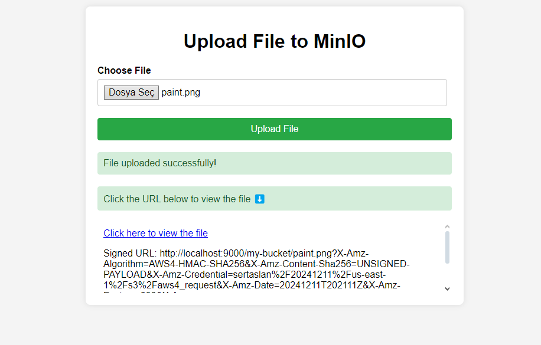

# s3 minIO Demo 🦩☁️📂


This project aims to set up an S3 compatible storage solution using MinIO and show you how to use the basic functions.
### Screenshots 📸
<div style="display: flex; flex-direction: row;">
    
  
</div>

## Prerequisites 📋

- **MinIO** 🖥️
- **Docker** 🐳
- **Node.js**  🟩

---

## Installation 💻

#### [Docker Installation](tutorials/InstallDocker.md) 📥
#### [Node Installation](tutorials/InstallNode.md) 📥


## Installing MinIO with Docker 🐳

1. **Run MinIO:**
To start MinIO using Docker, run the following command:

```bash

docker run -p 9000:9000 -p 9001:9001 --name minio -d -v ~/minio/data:/data -e "MINIO_ROOT_USER=YOUR_ACCESS_KEY"
 -e "MINIO_ROOT_PASSWORD=YOUR-SECRET-KEY" minio/minio server --console-address :9001 /data
```

# **MinIO File Management Guide** 📂

This guide explains how to manage files within an existing bucket in the MinIO web interface.

## **1. Access the MinIO Interface** 🌐
1. Open your browser and go to the MinIO web interface URL (e.g., `http://localhost:9001`).
2. Log in with your **Access Key** and **Secret Key**.

## **2. Open an Existing Bucket** 📁
1. After logging in, you will see a list of buckets.
2. Click the name of the bucket you want to work with.

## **3. Upload Files** ⬆️
1. Once inside the bucket, click the **Upload** button.
2. Drag and drop files into the provided area or click **Browse** to select files from your computer.
3. Click **Upload** to add the files.

## **4. Manage Files** ⚙️
- **View Files:**
   - Navigate through the bucket's folders and files by clicking on their names.
- **Download Files:**
   - Click the file’s **Actions** menu (three dots) and select **Download**.
- **Rename Files:**
   - In the **Actions** menu, click **Rename**. Enter the new name and confirm.
- **Delete Files:**
   - Select the file using the checkbox, then click the **Delete** button and confirm the action.

## **5. Create Folders** 📂
1. Inside the bucket, click the **New Folder** button.
2. Enter a name for the folder and click **Create**.

## **6. Generate Public Links** 🌍
> **Note:** This feature must be enabled by the administrator.
1. Select the file and click **Share** or **Generate Link**.
2. Copy the link to share the file publicly.

---

## Using MinIO with Express.js as a Backend 🛠️

In the previous guide, we explored how to manage files using the MinIO Web Interface. Now, let's look at how you can use Express.js to interact with MinIO programmatically, creating an API to upload files, generate signed URLs, and manage file operations.
## 1. Project Overview 📜
This Express.js application demonstrates the following key functionalities:

- **File Upload to MinIO Bucket:** Upload files to a MinIO bucket via a dedicated API endpoint. 📂⬆️
- **Signed URL Generation:** Generate signed URLs that provide secure, temporary access to files stored in the MinIO bucket. 🔑🔗
- **MinIO as S3-Compatible Object Storage:** Leverage MinIO as a local, S3-compatible object storage solution for development purposes. 💾⚙️

## 2. Clone Project 📦
 📥 After cloning the repo install dependecies with

 ```sh 
    npm i && node index.js
```
after running scripts go to http://localhost:3000 with your browser to use the app. 🌐

## 3. Setting Up the .env File ⚙️
    
1. **Creating the .env File:** 📝
   - Start by copying the `.env.example` file and creating a new file named `.env`.
   - Make sure to fill in the contents of the `.env` file.


2. **Defining Environment Variables:** 🔧

 - In the `.env` file, define the following variables for your MinIO configuration:

   ```sh
      ACCESS_KEY =  YOUR_ACCESS_KEY
      SECRET_KEY = YOUR_SECRET_KEY
      BUCKET_NAME = YOUR_BUCKET_NAME
   ```
